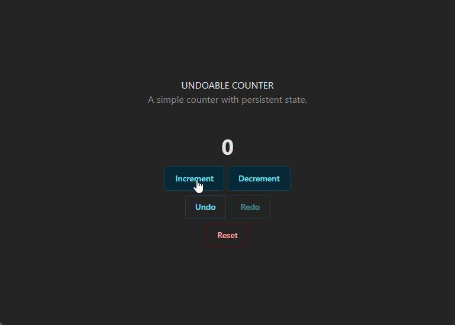

# React Counter App with Undo/Redo

A simple counter application built with React and TypeScript. 
This project was built to demonstrate these key concepts:

- `useReducer` for state management
- Context API for global state
- Undo/Redo functionality
- Persistent state using `localStorage`
- Styled with Chakra UI

## 🌱 DEMO

[Live demo site on Vercel](https://undoable-counter-rho.vercel.app/)

## ✨ Technologies Used

- React/TypeScript
- [Chakra UI](https://chakra-ui.com/)
- [Vite](https://vitejs.dev/)

